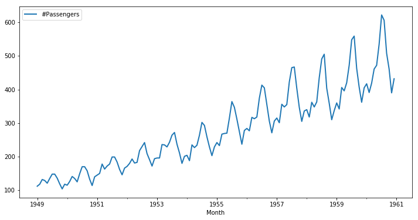

# Testing for Trends - Lab

## Introduction

In this lab, you'll practice your knowledge on testing for stationarity.

## Objectives

You will be able to:

* Check and comment on the stationarity of time series data 
* Use rolling statistics as an initial check for stationarity 
* Use the Dickey Fuller Test for performing statistical testing for time series stationarity

## Importing the data

Let's look at some new data. In this lab, We'll work by creating a time-series object in Python by using the popular [Air Passengers dataset](https://www.analyticsvidhya.com/wp-content/uploads/2016/02/AirPassengers.csv).

This dataset is stored as `passengers.csv`.


```python
# Import necessary libraries

```


```python
# __SOLUTION__ 
# Import necessary libraries

import pandas as pd
from pandas import Series
import numpy as np
import matplotlib.pylab as plt
%matplotlib inline

#from matplotlib.pylab import rcParams
#rcParams['figure.figsize'] = 15, 6
```

Import `passengers.csv` and view the head.


```python
# Read the dataset 'passengers.csv' and view the head

# Month	#Passengers
# 0	1949-01-01	112
# 1	1949-02-01	118
# 2	1949-03-01	132
# 3	1949-04-01	129
# 4	1949-05-01	121
```


```python
# __SOLUTION__ 
# Read the dataset 'passengers.csv' and view the head
data = pd.read_csv('passengers.csv')
data.head()

# Month	#Passengers
# 0	1949-01-01	112
# 1	1949-02-01	118
# 2	1949-03-01	132
# 3	1949-04-01	129
# 4	1949-05-01	121
```


<div>
<style scoped>
    .dataframe tbody tr th:only-of-type {
        vertical-align: middle;
    }

    .dataframe tbody tr th {
        vertical-align: top;
    }

    .dataframe thead th {
        text-align: right;
    }
</style>
<table border="1" class="dataframe">
  <thead>
    <tr style="text-align: right;">
      <th></th>
      <th>Month</th>
      <th>#Passengers</th>
    </tr>
  </thead>
  <tbody>
    <tr>
      <th>0</th>
      <td>1949-01-01</td>
      <td>112</td>
    </tr>
    <tr>
      <th>1</th>
      <td>1949-02-01</td>
      <td>118</td>
    </tr>
    <tr>
      <th>2</th>
      <td>1949-03-01</td>
      <td>132</td>
    </tr>
    <tr>
      <th>3</th>
      <td>1949-04-01</td>
      <td>129</td>
    </tr>
    <tr>
      <th>4</th>
      <td>1949-05-01</td>
      <td>121</td>
    </tr>
  </tbody>
</table>
</div>


Change the `Month` column over to a `datetime` object and make sure it is set as the index.


```python
# Set month column as a timeseries object, and make it the index

```


```python
# __SOLUTION__ 
# Set month column as a timeseries object, and make it the index
data.Month = pd.to_datetime(data.Month)
data.info()

data.set_index('Month', inplace = True)
```

    <class 'pandas.core.frame.DataFrame'>
    RangeIndex: 144 entries, 0 to 143
    Data columns (total 2 columns):
    Month          144 non-null datetime64[ns]
    #Passengers    144 non-null int64
    dtypes: datetime64[ns](1), int64(1)
    memory usage: 2.3 KB


```python
# check the head and the new index


# DatetimeIndex(['1949-01-01', '1949-02-01', '1949-03-01', '1949-04-01',
#                '1949-05-01', '1949-06-01', '1949-07-01', '1949-08-01',
#                '1949-09-01', '1949-10-01',
#                ...
#                '1960-03-01', '1960-04-01', '1960-05-01', '1960-06-01',
#                '1960-07-01', '1960-08-01', '1960-09-01', '1960-10-01',
#                '1960-11-01', '1960-12-01'],
#               dtype='datetime64[ns]', name='Month', length=144, freq=None)
```


```python
# __SOLUTION__ 
# check the head and the new index
data.head()
data.index

# DatetimeIndex(['1949-01-01', '1949-02-01', '1949-03-01', '1949-04-01',
#                '1949-05-01', '1949-06-01', '1949-07-01', '1949-08-01',
#                '1949-09-01', '1949-10-01',
#                ...
#                '1960-03-01', '1960-04-01', '1960-05-01', '1960-06-01',
#                '1960-07-01', '1960-08-01', '1960-09-01', '1960-10-01',
#                '1960-11-01', '1960-12-01'],
#               dtype='datetime64[ns]', name='Month', length=144, freq=None)
```


    DatetimeIndex(['1949-01-01', '1949-02-01', '1949-03-01', '1949-04-01',
                   '1949-05-01', '1949-06-01', '1949-07-01', '1949-08-01',
                   '1949-09-01', '1949-10-01',
                   ...
                   '1960-03-01', '1960-04-01', '1960-05-01', '1960-06-01',
                   '1960-07-01', '1960-08-01', '1960-09-01', '1960-10-01',
                   '1960-11-01', '1960-12-01'],
                  dtype='datetime64[ns]', name='Month', length=144, freq=None)


Now that we have successfully created a TS object, we can use simple `plot()` function in pandas to visually inspect this time-series.


```python
# Plot the time series data 

```


```python
# __SOLUTION__ 
# Plot the time series data
data.plot(figsize=(12,6), linewidth=2, fontsize=10);
```





It is clearly evident that there is an overall increasing trend in the data along with some seasonal variations. However, it might not always be possible to make such visual inferences. Let's reconfirm this here using both **rolling statistics** and 

## Rolling Statistics 

Use the `.rolling()` function to find rolling mean and rolling std with a window of 12 months. Plot the original curve along with the rolling mean and standard error.


```python
#Determine rolling statistics

```


```python
# __SOLUTION__ 
#Determine rolling statistics

rolmean = data.rolling(window = 12, center = False).mean()
rolstd = data.rolling(window = 12, center = False).std()
```


```python
#Plot rolling statistics

```


```python
# __SOLUTION__ 
#Plot rolling statistics
fig = plt.figure(figsize=(12,6))
orig = plt.plot(data, color='blue',label='Original')
mean = plt.plot(rolmean, color='red', label='Rolling Mean')
std = plt.plot(rolstd, color='black', label = 'Rolling Std')
plt.legend(loc='best')
plt.title('Rolling Mean & Standard Deviation')
plt.show()
```


Though the variation in standard deviation is small, mean is clearly increasing with time and thus, this is not a stationary series. 

## Dickey-Fuller Test 

Use the Dickey-Fuller Test to verify your visual result.


```python
from statsmodels.tsa.stattools import adfuller

#Perform Dickey-Fuller test:

# Extract and display test results in a user friendly manner

# Results of Dickey-Fuller Test:
# Test Statistic                   0.815369
# p-value                          0.991880
# #Lags Used                      13.000000
# Number of Observations Used    130.000000
# Critical Value (1%)             -3.481682
# Critical Value (5%)             -2.884042
# Critical Value (10%)            -2.578770
# dtype: float64
```


```python
# __SOLUTION__ 
from statsmodels.tsa.stattools import adfuller

#Perform Dickey-Fuller test:
print ('Results of Dickey-Fuller Test:')
dftest = adfuller(data['#Passengers'])

# Extract and display test results in a user friendly manner
dfoutput = pd.Series(dftest[0:4], index=['Test Statistic','p-value','#Lags Used','Number of Observations Used'])
for key,value in dftest[4].items():
    dfoutput['Critical Value (%s)'%key] = value
print (dfoutput)


# Results of Dickey-Fuller Test:
# Test Statistic                   0.815369
# p-value                          0.991880
# #Lags Used                      13.000000
# Number of Observations Used    130.000000
# Critical Value (1%)             -3.481682
# Critical Value (5%)             -2.884042
# Critical Value (10%)            -2.578770
# dtype: float64
```

    Results of Dickey-Fuller Test:
    Test Statistic                   0.815369
    p-value                          0.991880
    #Lags Used                      13.000000
    Number of Observations Used    130.000000
    Critical Value (1%)             -3.481682
    Critical Value (5%)             -2.884042
    Critical Value (10%)            -2.578770
    dtype: float64


## Level up - Optional

Repeat the previous steps for the NYSE monthly data , stored in "NYSE_monthly.csv".

## Summary

In this lab, you learned to check for the stationarity of a time-series object in Python. Next, we'll further explore stationarity and how to make sure to make time series stationary!
